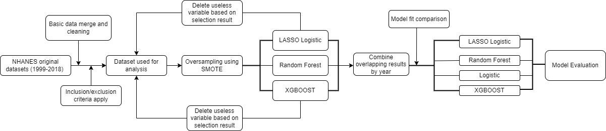
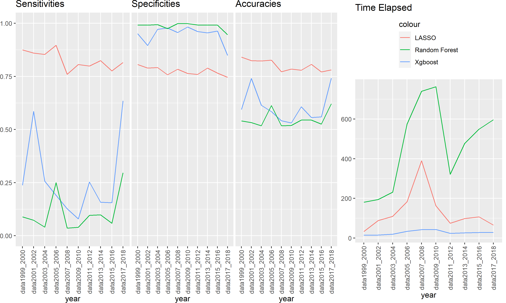

```{r global_options, include=FALSE}
knitr::opts_chunk$set(fig.pos = 'H')
```

# 1. Background and Objectives

With a high prevalence of overweight individuals growing in the US, there is a trend of increasing prevalence in diabetes. To better control and prevent the development of diabetes, we aim to discover the most significant covariates and find the best machine learning algorithm for predicting diabetes, thus could give individual prevention ideas and help with earlier diagnosis of diabetes.

# 2. Method
## 2.1 Study Population
The dataset we used is the National Health and Nutrition Examination Survey (NHANES), a program of studies designed to assess adults and children's health and nutritional status in the United States, provided by the Centers for Disease Control and Prevention (CDC). The data range from 1999 to 2018, each with a cross-sectional study of two years. Different individuals were enrolled every two years. Data includes demographic, dietary, examination, laboratory, and questionnaire data.

## 2.2 Data cleaning
All the datasets were downloaded from the [\underline{NHANES website}](https://wwwn.cdc.gov/nchs/nhanes/Default.aspx) and then arranged by year and data type(Demographic, Dietary, Examination, Laboratory and Questionnaire). An indicator table was made to check the coverage of each dataset (see "Reference/Codebook for datatables V2.xlsx"). Based on the indicator table, we decided to use the following inclusion/exclusion criteria to choose the datasets to include.

* Drop datasets without Sequence ID information
* Select the datasets with information appearing in more or equal to 10 year period.
* Use easy-to-obtain variables: Demographic, Questionnaires and easy examination like Weight, Height, Oral, Vision and Audiometry.

After basic exclusion, we merged the selected datasets and further excluded variables based on the following criteria:

* Drop variables in the Diabetes questionnaire, only keep DIQ010 as the outcome.
* Exclude survey weights related variables.
* Drop variables with more than 20% missingness across each two-year period.
* Remove all levels(factor) == 1 variable/constant variable for each year period

Our outcome variable:

* Diabetes was defined as “Doctor told you have diabetes”(named as DIQ010 in the NHANES dataset). 1 refers to Yes, 2 refers to No, 3 refers to Borderline, 7 refers to Refused, 9 refers to don’t know. Yes and Borderline were combined as “Yes”, 7, 9 and NA were excluded from the analysis. The variable was then releveled to 0 and 1: 1 being Yes and 0 being No.

## 2.3 Analysis Approach

In the whole dataset with over 3000 variables, each having different missingness, there was no complete case in our data. Moreover, there were less than 200 variables with less than 20% missing values. To prevent excluding potentially useful variables and keep as many observations as possible, instead of modelling on the whole dataset, we predicted diabetes in each group. After conducting feature selection by every two years, we combined the variables which contributed the most in each group.  

Another problem we met was that our data was imbalanced.  The ratio of positive to negative class in response was 1:11. Synthetic Minority Oversampling Technique (SMOTE) was introduced to deal with the imbalanced data issue. SMOTE is a commonly used oversampling method to re-balance the response variable for better performance on predictive models. To avoid over-fitting, we partitioned data into training and testing data and applied SMOTE to rebalance the response variable.
 
The feature selection methods in our project include LASSO, Xgboost, and Random Forest. By applying those methods to our data of 10 groups, we obtained the corresponding variables selected by each method and compared the sensitivities, specificity, accuracy, and time elapsed among the three models. We then determined which variables should be further selected based on the performances. Furthermore, we also checked the meaning of those variables selected to prevent the problem of multicollinearity. After determining the final variable set, we wanted to know if those variables would perform well in our overall data using the different machine learning methods. Thus we fit models again using our final selected variables.  

Complete cases were used in the final model. R version 4.1.2 was used for the analysis.

Following is the summary of our analysis approach.

```{r pressure, echo=FALSE, fig.cap="Analysis Approach", out.width = '100%'}

```


# 3. Results

## 3.1 Feature Selection
Following is the sensitivity and specificity results for each year using different methods in the variable selection process.

```{r Sensitivity, echo=FALSE, fig.cap="Sensitivity, Specificity and Accurancy by year",out.width = '100%',out.height="60%"}

```


Based on the results, we found that XGBoost and Random Forests have unsatisfiable sensitivity, which gave no reason to include variables selected by the above two methods. As a result, we only kept the variables selected by LASSO.  
We further reduced the number of variables according to at least a 50 percent selection rate in the years they appeared and less than 10,000 missing values.   
Here we present the descriptions of each selected variable.

Following is the plot showing the overall importance of variables selected.


\begin{figure}[h]
\begin{subfigure}{.65\textwidth}
\includegraphics[]{"../Results/Importance_matrix.png"}
\end{subfigure}%
\begin{subfigure}{.35\textwidth}
\includegraphics[]{"../Results/Var_meaning.png"}
\end{subfigure}
\caption{Variables of selection}
\end{figure}


Based on the results, we found that Age(RIDAGEYR), Overall Health(HUQ010), BMI(BMXBMI), Routine place to go for healthcare(HUQ030) are the most important variables used to predict diabetes. 

## 3.2 Model comparision

The following confusion matrices compare our final models fitted using the selected variables shown above. Overall, Logistic regression, LASSO Logistic Regression, Random Forest and XGBoost all produced similar results. Both logistic regression types had a slight advantage in sensitivity, where Random Forest and XGBoost showed higher specificity.

```{r, echo=FALSE,fig.cap="Confusion Matrix", fig.show="hold", out.width="50%"}
knitr::opts_chunk$set(fig.pos = 'H')
knitr::include_graphics(c("../Results/Confusion_matrix_log.png","../Results/Confusion_matrix_lasso.png"),dpi = 100)
knitr::include_graphics(c("../Results/Confusion_matrix_XGboost.png","../Results/Confusion_matrix_RF.png"),dpi = 100)
```

# 4. Conclusion

## 4.1 Feature Selection

Based on our result, it was evident that LASSO worked great in feature selection while the sensitivities of Xgboost and Random Forest are not consistent and thus not ideal. Therefore, feature selection results were only considered from the output of LASSO. Features were selected according to at least 50% rate of being selected by the model to the number of years the variables appeared in the data. To make sense of the variables selected from the model and prevent multicollinearity, meaningless variables or variables with high correlation with the others were excluded from the selection. Since overall, there were around 3,000 variables that needed to be selected, it would be tedious to check each of the variables manually. Thus, we decided to run the selection process first and then check the selected variables. This process has saved us lots of labour.

## 4.2 Challenges and solutions:

Because of the high missingness and each survey year having its own distinct featured variables, there were no complete cases if we worked on the overall dataset. Our solution was to subset the dataset based on each observation's survey year and feed the ten data groups to different methods simultaneously in parallel on the Biostatistics cluster. After selecting the features, we combined the variables that contributed the most to each group. With this approach, PCA/LDA could not be applied as we could not distinguish and thus were unable to combine the variables from the dimensions reduced across groups.

As we have mentioned above, the outcome of interests in our dataset was highly imbalanced, which results in low sensitivity in the feature selection process. After literature reviews, Synthetic Minority Oversampling Technique (SMOTE) was introduced to deal with the imbalanced data issue. After applying SMOTE to rebalance the response variable, all the sensitivities obtained improved, whereas the results from Random Forest and XGBoost were still dissatisfying, with most sensitivities being less than 0.5. Thus, we only accepted the featured selected by LASSO.

The training process has been time-consuming since we had large high-dimension in each year group. Our solution was to use parallel computation and cluster computing to speed up our selection process. 

## 4.3 Future works

One of the biggest problems is that our imbalanced data. Although we tried oversampling in the minority group using SMOTE, the results in the feature selection process were still not ideal for Xgboost and Random forest models. It would be of great interest for us if there is any better way to handle the imbalanced data and apply Xgboost and Random Forest again to see if the features selection process of these two models could perform better. On the other hand, as Random Forest and Xgboost are not good at handling imbalanced data and cannot adjust the hyperparameters automatically, we would also be interested in improving the algorithm of these two methods in the future.

Another limitation in our data is large missingness. Due to our lack of knowledge in missing data, we only used complete cases in our project, which may cause losing some information. We also hope to find a better way of handling missing data that might improve our overall result.

# 5 Group contribution

* Xueting Tao: Downloading the data, data cleaning and merging, finalize the final report.
* Jinhao Wang: Main Data Analysis, finalize the final report.
* Yili Wang: Figure generating, finalize the final report.
* Dongyang Zhao: Cluster and parallel computing, finalize the final report.
