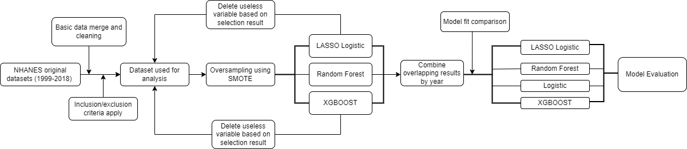
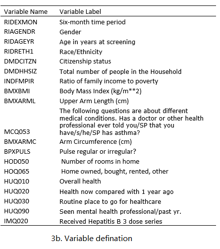

# Background and Objectives

With a high prevalence of overweight individuals growing in the US, there is a trend of increasing prevalence in diabetes as well. To better control and prevent the development of diabetes, we aim to discover the most significant covariates and find the best machine learning algorithm for predicting diabetes, thus could give individual prevention ideas and help with earlier diagnosis of diabetes.

# Method
## Study Population
The Dataset we will be using is the National Health and Nutrition Examination Survey (NHANES), a program of studies designed to assess the health and nutritional status of adults and children in the United States,provided by the Centers for Disease Control and Prevention (CDC). The data range from 1999-2018, each with two years of a cross-sectional study. Different individuals were enrolled every two years. Data includes demographic, dietary, examination, laboratory, and questionnaire data.

## Variables of selection
### Outcome of Prediction
Diabetes was defined as “Doctor told you have diabetes”(named as DIQ010 in the NHANES dataset). 1 refers to Yes, 2 refers to No, 3 refers to Borderline, 7 refers to Refused, 9 refers to don’t know. Yes and Borderline were combined as “Yes”, 7, 9 and NA was excluded from the analysis.

### Inclusion And Exclusion Criteria for variable selection

* Drop data without Sequence ID information
* Select datasets have more or equals to 5 year period
* Use easy-to-obtain dataset: Demographic, Questionnaires and easy examination like Weight, Height, Oral, Vision and Audiometry.
* Variables in the Diabetes questionnaire was dropped, only keep DIQ010 as outcome.
* Weighted related variables were excluded.
* Variables with missingness less than 20% each year period was kept.
* Remove all levels(factor) == 1 variable/constant variable for each year period
* After selection, we first select that variables that have more than 30% of overlap between years, then exclude the variables that have overall missingness more than 10,000.
* Complete cases was kept in the final model.

## Analysis Approach

Insert flowchart here:
```{r pressure, echo=FALSE, fig.cap="Analysis Approach", out.width = '100%'}

```

Key points:
* Oversampling using SMOTE
* 


# Results
```{r varm, echo=FALSE, fig.cap="Variables selected", out.width = '100%'}

```


# Conclusion


* SVM, rf, DT not ideal in our situation
* LASSO, XGBOOST works great
* Feature Selection using LASSO/XGBOOST:
  + Lasso: features that’s important in 9 or 10 years
  + Xgboost: Importance/Gain larger than 1/n
* In order to make the result meaningful, meaningless variables need to be excluded based on selection. The process has been rerun multiple times. -- Data is messy with over 3000+ variables without cleaning, thus, difficult to select by hand. -- Thus use this process.

## Computational chanllege and solutions:

* High missingess and low overlap on the variables for different year of survey, thus, there is no complete cases if we work on the overall dataset. 
  + we chose to separate the analysis for different year and then combine to chose the highly overlapped variables
  + Drawback: Tried PCA/LDA, dimension reduction cannot be applied when we have data separated by year

* Figured the imbalance data problem ### 1:11
  + Talk about difference between class weights and SMOTE
  + Oversampling using SMOTE 
* Separate Data by year:no complete case in the overall dataset, some of the variables in the NHANES have different names throughout the years.
  + so we only chose those variables with missingness less than 10%.
  + Drawback: give us even larger datasets
  
* Feature selection is slow:
  + pack feature selection as separate functions and run on cluster
  
* Overall around 3,000 variables needed to be selected, difficult to clean by hand.
  + Thus, we first select, then based on the selection results, clean out meaningless variables and possible colinearities(like age in month & age in year)
  + After cleaning, we run the selection again until the selected variables are all meaningful.
  + Drawback: Saves labor but cost more time on running.
  
## Future works

* Try the same process on less-missingness data
* Try imputation on the missing variables

